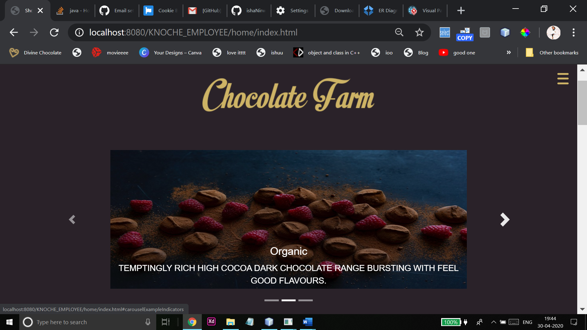
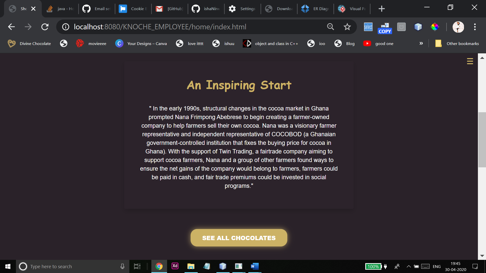
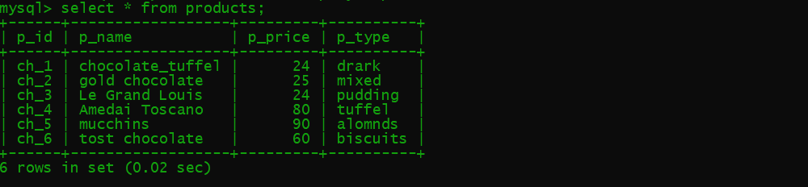
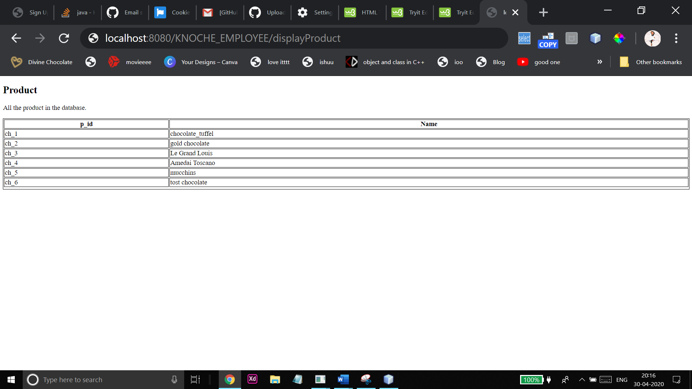
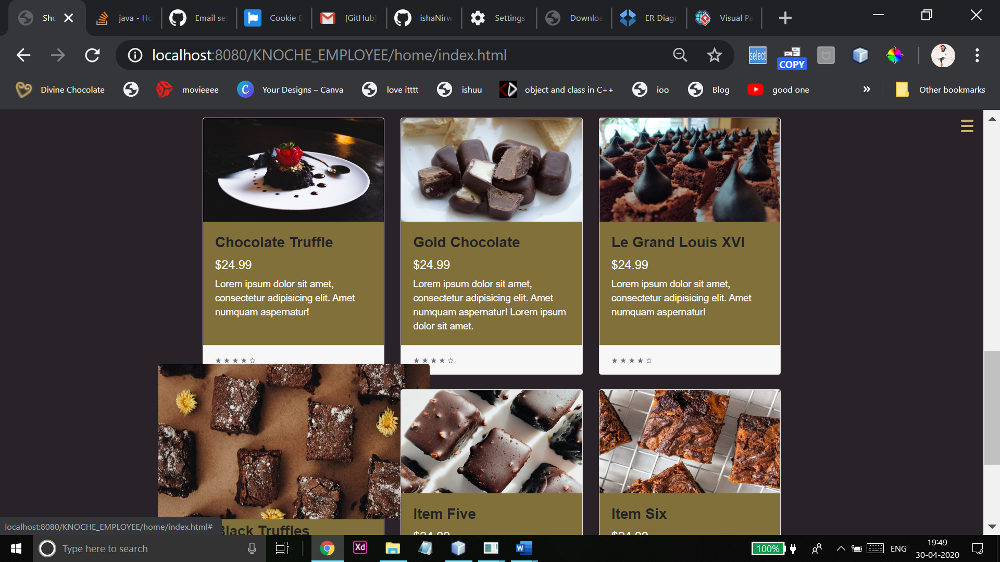
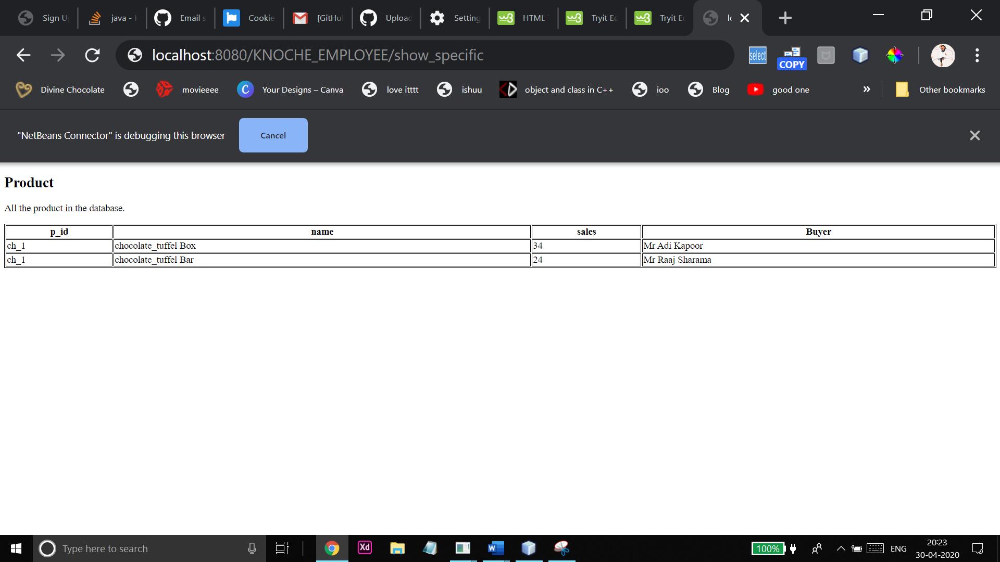
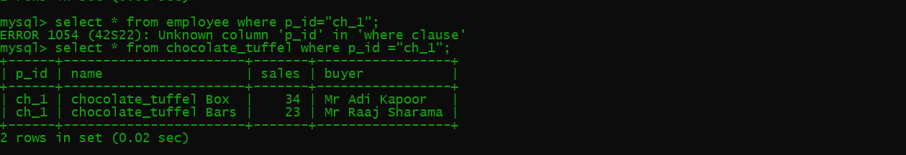
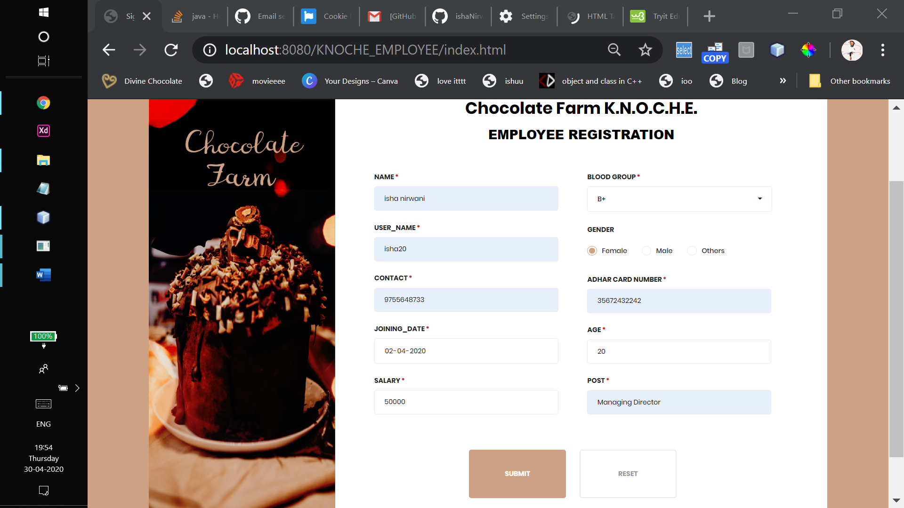
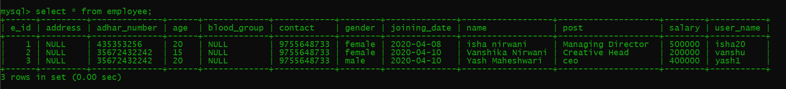
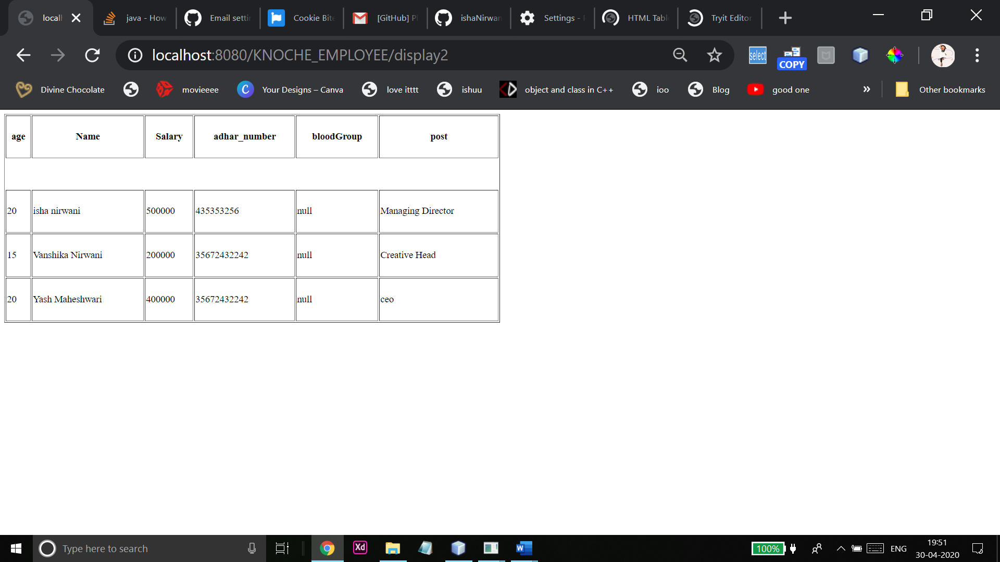

<h1>KNOCHE PROJECT</h1>
It’s a Company Administration Web application. Its design to give a comfortable environment with the ease in writing and reading data from databases as well as it provides security of JAVA.
Objective

This section presents a conceptual overview of the solution, and then provides an introduction to its requirements.

Solution Concept
The Knochee software consists of: 
•	Employee Registration into the database: Automate the current names of employee generation system and maintain the searchable customer, products database and product invoice, maintain the data security, user rights. 
•	Report Product: It automatically generates the product report and the sale of the product 
  
Technologies used:
Front End 
•	jQuery 
•	html 
•	javascript 
•	Bootstrap 

<B>Back End</B>

1.	Java (NetBeans)
•	Hibernet 
•	Servlet 
•	Jsp 
•	GlassFish Server 
  

Web Pages and Application 

1.	Product page 
It is the home page of our project where the admin can access: 
•	The list of all available products 
•	Availability of the products 
•	Kinds of products 
•	Sales of the product 
•	Buyer of the specific product 

1.	Front Home Page 

This is the main page. It has different connections with the servlet for performing data retrival from the databases and performing several queries.

2.	See All Section

* •	Mysql Table of the Products

*  Output of the request run by displayProduct.java 

3.	See Particular Product Section 

*  output by show_specific requested product 

* mysql table of the specific product (chocolate tuffel)
 

4. Registration page 

•	Data is entering in mysql table
 
•	The result when we click on display all employees (on controller/display.java)

